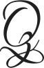

    

   
   
   
   
   
   
   
   
   
   
   
   
   

___

# Q-project

## List 

- [HackerEarth](./hackerearth)
- [HackerRank](./hackerrank)
- TBD

## About me

I am a Full-stack developer, which means if you give me one more task, my stack will overflow :smile:

* [My GitHub](https://github.com/HBinhCT)
* [My LinkedIn](https://www.linkedin.com/in/hbinhct)

